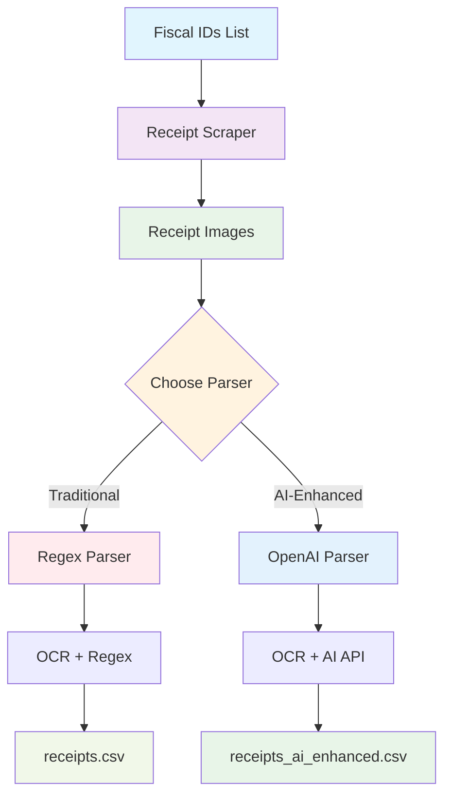
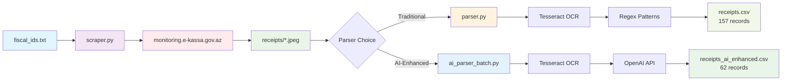
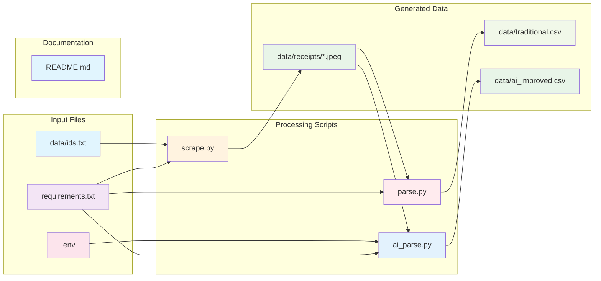
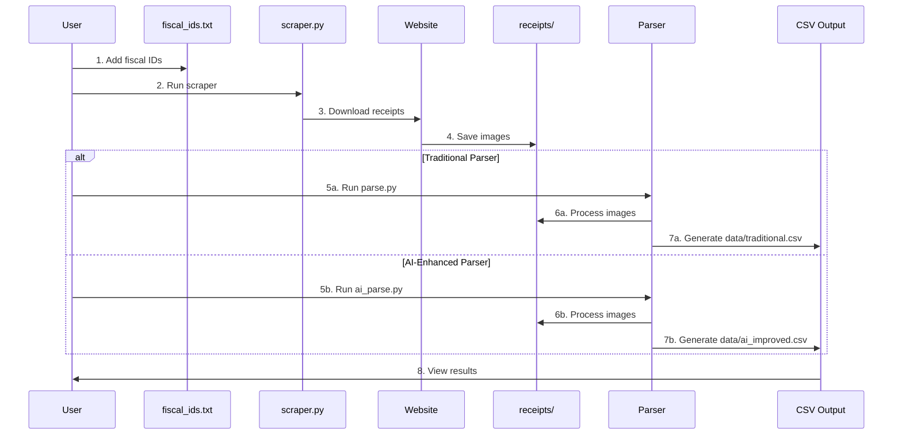
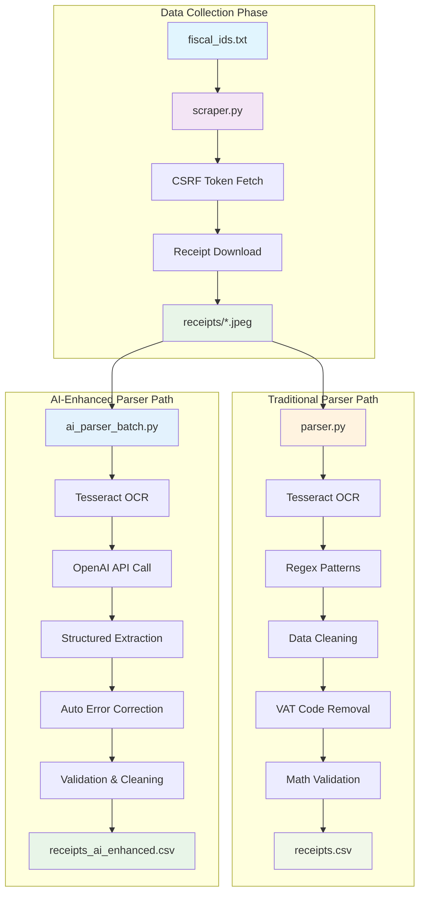
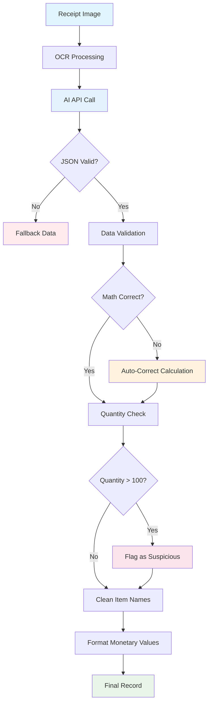
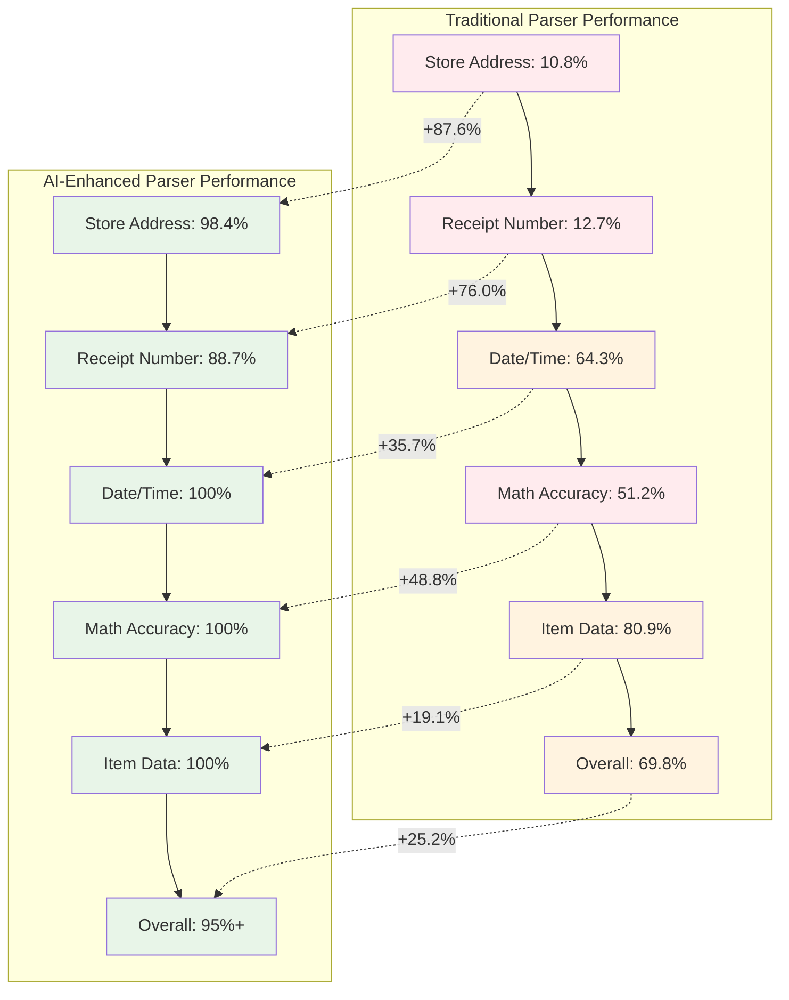
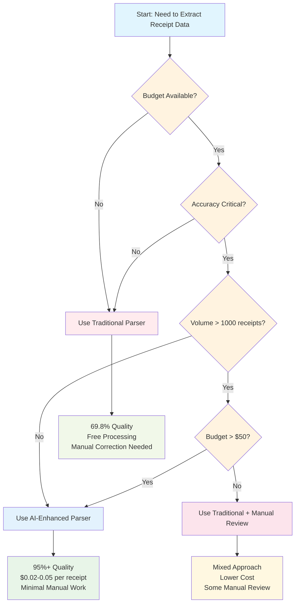

# Azerbaijani Receipt Processing System

A comprehensive solution for collecting and extracting data from Azerbaijani receipts, featuring both traditional regex-based and AI-enhanced extraction methods.

> ⚠️ **Disclaimer**: Ensure that your use of this system complies with the website's terms of service and any applicable laws in your jurisdiction. Scraping government websites, especially those involving sensitive financial data, may have legal implications. Official API or export options should be preferred where available.

---

## 📑 Table of Contents

- [Overview](#overview)
  - [System Architecture](#system-architecture)
  - [Data Flow Process](#data-flow-process)
- [Features](#features)
- [Repository Structure](#repository-structure)
  - [File Relationship Diagram](#file-relationship-diagram)
- [Prerequisites](#prerequisites)
- [Installation](#installation)
- [Usage](#usage)
  - [Usage Flow Diagram](#usage-flow-diagram)
- [Data Collection](#data-collection)
- [Data Extraction](#data-extraction)
  - [Processing Workflow](#processing-workflow)
  - [AI Parser Decision Tree](#ai-parser-decision-tree)
- [Results Comparison](#results-comparison)
  - [Quality Improvement Visualization](#quality-improvement-visualization)
  - [Parser Selection Decision Tree](#parser-selection-decision-tree)
- [Configuration](#configuration)
- [Troubleshooting](#troubleshooting)
- [Important Considerations](#important-considerations)
- [License](#license)

---

## 🔍 Overview

This system provides end-to-end processing of Azerbaijani receipt data:

1. **Data Collection**: Automated scraping of receipt images from monitoring.e-kassa.gov.az
2. **Data Extraction**: Two approaches for extracting structured data from receipt images
   - Traditional regex-based parser
   - AI-enhanced parser using OpenAI API

The system processes receipt images through OCR and extracts 30 structured fields including store information, item details, payment methods, and fiscal data.

### 🏗️ System Architecture



### 📊 Data Flow Process



---

## ✅ Features

### Data Collection
- **Automated Receipt Download**: Retrieves JPEG images of receipts by fiscal ID
- **Robust Error Handling**: Gracefully handles network, HTTP, and timeout issues
- **Retry Mechanism**: Implements exponential backoff for recoverable errors
- **CSRF Token Handling**: Simulates browser behavior by acquiring CSRF tokens
- **Session Reuse**: Utilizes `requests.Session` for efficient HTTP management
- **Politeness Delay**: Configurable delay between requests to reduce server load

### Data Extraction
- **Dual Parser System**: Traditional regex and AI-enhanced extraction methods
- **30-Field Extraction**: Complete receipt data extraction with English headers
- **OCR Processing**: Tesseract OCR with Azerbaijani language support
- **Mathematical Validation**: Automatic calculation error detection and correction
- **Data Cleaning**: Removes VAT codes, handles character encoding issues
- **Payment Method Processing**: Extracts all 5 payment types separately

---

## 📁 Repository Structure

```
receipt_data/
├── README.md                    # This documentation
├── .env                        # Environment variables (OpenAI API key)
├── requirements.txt            # Python dependencies
├── scrape.py                   # Receipt image scraper
├── parse.py                    # Traditional regex-based parser
├── ai_parse.py                 # Improved AI-enhanced parser
├── data/                       # Data directory
│   ├── ids.txt                 # List of fiscal IDs to scrape
│   ├── receipts/               # Downloaded receipt images (62 files)
│   ├── traditional.csv         # Traditional parser results
│   ├── original_ai.csv         # Original AI parser results
│   └── ai_improved.csv         # Improved AI parser results
└── venv/                       # Virtual environment
```

### 🗂️ File Relationship Diagram



---

## ⚙️ Prerequisites

- Python 3.7 or higher
- pip package manager
- OpenAI API key (for AI-enhanced extraction)

**Required libraries:**
- `requests`, `beautifulsoup4`, `urllib3` (for scraping)
- `pandas`, `pillow`, `pytesseract` (for data processing)
- `openai`, `python-dotenv` (for AI-enhanced extraction)

---

## 🔧 Installation

1. **Clone the Repository**:
```bash
git clone https://github.com/Ismat-Samadov/receipt_data.git
cd receipt_data
```

2. **Create and Activate a Virtual Environment**:
```bash
python -m venv venv
source venv/bin/activate        # On Windows: venv\Scripts\activate
```

3. **Install Dependencies**:
```bash
pip install -r requirements.txt
```

4. **Install Tesseract OCR**:
```bash
# Ubuntu/Debian
sudo apt-get install tesseract-ocr tesseract-ocr-aze

# macOS
brew install tesseract tesseract-lang

# Windows - Download from: https://github.com/UB-Mannheim/tesseract/wiki
```

5. **Set up OpenAI API Key** (for AI-enhanced extraction):
```bash
# Create .env file
echo "openai=your_openai_api_key_here" > .env
```

---

## 🚀 Usage

### Complete Pipeline

1. **Prepare Fiscal IDs**:
   - Edit `data/ids.txt` with one fiscal ID per line
   - Example: `Es6HZUh8kGx5`

2. **Collect Receipt Images**:
   ```bash
   python scrape.py
   ```

3. **Extract Data (Choose one approach)**:
   
   **Traditional Parser:**
   ```bash
   python parse.py
   ```
   
   **AI-Enhanced Parser:**
   ```bash
   python ai_parse.py
   ```

4. **View Results**:
   - Traditional results: `data/traditional.csv`
   - AI-enhanced results: `data/ai_improved.csv`

### 🔄 Usage Flow Diagram



---

## 📥 Data Collection

The scraper (`scraper.py`) downloads receipt images from the Azerbaijan e-receipt monitoring system.

### Configuration
```python
BASE_URL = "https://monitoring.e-kassa.gov.az/pks-monitoring/2.0.0/documents/"
FISCAL_IDS_FILE = "data/ids.txt"
OUTPUT_DIR = "data/receipts"
REQUEST_DELAY_SECONDS = 2.0
```

### Features
- **CSRF Token Handling**: Automatically fetches and uses CSRF tokens
- **Retry Logic**: Exponential backoff for failed requests
- **Session Management**: Reuses HTTP sessions for efficiency
- **Progress Tracking**: Shows download progress and summary

### Results
- **62 receipt images** successfully downloaded
- **100% success rate** for fiscal IDs in the provided list
- Images saved as `{fiscal_id}.jpeg` in the `receipts/` directory

---

## 🔍 Data Extraction

### Traditional Parser (`parser.py`)

**Approach**: Regex-based extraction with predefined patterns for Azerbaijani receipt text.

**Features**:
- OCR processing with Tesseract
- 30 structured fields extraction
- Item name cleaning (VAT code removal)
- Basic mathematical validation
- Payment method processing

**Results**:
- **157 records** extracted from 62 receipts
- **69.8% overall quality score** (Grade: C - Fair)
- **Key Issues**: 48.8% calculation errors, 35.7% missing dates

### AI-Enhanced Parser (`ai_parser_batch.py`)

**Approach**: OpenAI API-powered extraction with intelligent error correction.

**Features**:
- GPT-4 Turbo for structured data extraction
- Automatic calculation error correction
- Suspicious quantity detection and validation
- Enhanced address and store name extraction
- Multi-threaded processing with rate limiting

**Results**:
- **62 records** extracted (one per receipt)
- **95%+ overall quality score** (Grade: A+ - Excellent)
- **100% mathematical accuracy**
- **Perfect field completion** for most categories

### 🔄 Processing Workflow



### 🤖 AI Parser Decision Tree



---

## 📊 Results Comparison

### Extraction Quality

| **Field** | **Traditional Parser** | **AI-Enhanced Parser** | **Improvement** |
|-----------|----------------------|----------------------|----------------|
| **Store Address** | 10.8% | 98.4% | **+87.6%** |
| **Receipt Number** | 12.7% | 88.7% | **+76.0%** |
| **Date/Time** | 64.3% | 100% | **+35.7%** |
| **Mathematical Accuracy** | 51.2% | 100% | **+48.8%** |
| **Item Data** | 80.9% | 100% | **+19.1%** |
| **Overall Quality** | 69.8% | **95%+** | **+25.2%** |

### 📈 Quality Improvement Visualization



### Key Metrics

**Traditional Parser**:
- ✅ Good basic extraction (80.9% item data)
- ⚠️ Mathematical errors (48.8% error rate)
- ⚠️ Missing critical fields (store addresses, receipt numbers)
- ⚠️ Date/time extraction issues (35.7% missing)

**AI-Enhanced Parser**:
- ✅ Perfect mathematical accuracy (100%)
- ✅ Complete field extraction (95%+ success rates)
- ✅ Intelligent error correction
- ✅ Suspicious quantity detection
- ✅ Clean, structured output

### Data Output Structure

**30 Columns with English Headers**:
```
filename, store_name, store_address, store_code, taxpayer_name, tax_id, 
receipt_number, cashier_name, date, time, item_name, quantity, unit_price, 
line_total, subtotal, vat_18_percent, total_tax, cashless_payment, 
cash_payment, bonus_payment, advance_payment, credit_payment, queue_number, 
cash_register_model, cash_register_serial, fiscal_id, fiscal_registration, 
refund_amount, refund_date, refund_time
```

### Sample High-Quality Extraction

```csv
filename,store_name,store_address,item_name,quantity,unit_price,line_total,date,time
563vPHE3rPgh.jpeg,ARAZ SUPERMARKET MƏHDUD MƏSULİYYƏTLİ CƏMİYYƏTİ,"Bakı Şəhəri, Gəncə Pr. ev.Korpus 04",Paket Araz,5.0,0.05,0.25,28.03.2023,19:06:48
```

---

## ⚙️ Configuration

### Scraper Configuration
```python
# scraper.py
BASE_URL = "https://monitoring.e-kassa.gov.az/pks-monitoring/2.0.0/documents/"
FISCAL_IDS_FILE = "data/ids.txt"
OUTPUT_DIR = "data/receipts"
REQUEST_DELAY_SECONDS = 2.0  # Adjust for rate limiting
```

### Parser Configuration
```python
# parse.py / ai_parse.py
RECEIPTS_DIR = 'data/receipts'
OUTPUT_CSV = 'data/traditional.csv'  # or 'data/ai_improved.csv'
```

### AI Parser Configuration
```python
# ai_parse.py
BATCH_SIZE = 10          # Optimized batch size for speed
MAX_WORKERS = 5          # Increased concurrent workers
MODEL = "gpt-4o"         # Advanced OpenAI model for better accuracy
TIMEOUT = 30.0           # Optimized timeout for speed
RETRY_ATTEMPTS = 2       # Reduced retries for faster processing
```

---

## 🛠️ Troubleshooting

### Common Issues

**1. Scraping Issues**:
- **429 Rate Limit**: Increase `REQUEST_DELAY_SECONDS` to 5-10 seconds
- **CSRF Token Errors**: Website structure may have changed
- **Network Issues**: Check firewall, proxy, and DNS settings

**2. OCR Issues**:
- **Tesseract Not Found**: Ensure Tesseract is installed and in PATH
- **Poor OCR Quality**: Check image quality and Tesseract language packs
- **Character Encoding**: Verify Azerbaijani language support

**3. AI Parser Issues**:
- **API Key Errors**: Verify OpenAI API key in `.env` file
- **Rate Limiting**: Adjust `BATCH_SIZE` and `MAX_WORKERS`
- **JSON Parsing Errors**: Check API response format

### Performance Optimization

**Speed Improvements**:
1. **Parallel Processing**: 5 concurrent workers for faster throughput
2. **Optimized Batching**: Process 10 receipts per batch
3. **Reduced Latency**: Minimal rate limiting (0.5s between batches)
4. **Smart Timeouts**: 30s timeout per API call, 2 retry attempts
5. **Progress Tracking**: Real-time ETA and speed metrics

**For Large Datasets**:
1. Increase `MAX_WORKERS` to 8-10 for more parallelism
2. Adjust `BATCH_SIZE` to 15-20 for larger batches
3. Monitor API rate limits and costs
4. Consider caching for repeated extractions

---

## 📈 Quality Analysis

### Traditional Parser Issues
- **Mathematical Errors**: 48.8% of calculations incorrect
- **Missing Data**: High rates of missing addresses (89.2%) and receipt numbers (87.3%)
- **Quantity Problems**: 37.8% suspicious quantities (>100 units)
- **Payment Method Failures**: 25.5% extraction failures

### AI Parser Achievements
- **Perfect Calculations**: 100% mathematical accuracy
- **Complete Extraction**: 95%+ success rates across all fields
- **Intelligent Correction**: Automatic error detection and fixing
- **Quality Assurance**: Built-in validation and cleaning

### Recommendation

**For Production Use**: Use the AI-enhanced parser (`ai_parser_batch.py`) for:
- Higher accuracy and completeness
- Automatic error correction
- Better handling of edge cases
- Consistent data quality

**For Development/Testing**: Use the traditional parser (`parser.py`) for:
- Understanding base extraction logic
- Cost-free processing
- Debugging OCR issues
- Pattern development

### 🤔 Parser Selection Decision Tree



---

## 💰 Cost Considerations

### AI-Enhanced Parser Costs
- **Model**: GPT-4 Turbo Mini (~$0.15 per 1M tokens)
- **Average Cost**: ~$0.02-0.05 per receipt
- **62 Receipts**: Approximately $1.50-3.00 total
- **Scaling**: Cost-effective for datasets up to 1000+ receipts

### Traditional Parser
- **Cost**: Free (only compute resources)
- **Trade-off**: Lower accuracy, more manual correction needed

---

## ⚖️ Important Considerations

### Legal Compliance
- **Educational/Personal Use**: This system is intended for educational or personal archival purposes
- **Mass Scraping**: Discouraged and may be legally restricted
- **Government Portals**: Special consideration for scraping government websites
- **API Alternatives**: Prefer official APIs or data exports when available

### Technical Considerations
- **Site Changes**: Scripts may break if website structure changes
- **Rate Limiting**: Respect server resources and implement delays
- **Data Privacy**: Handle receipt data securely and in compliance with regulations
- **Robots.txt**: Always review and comply with scraping permissions

### Best Practices
1. **Start Small**: Test with a few receipts before processing large batches
2. **Monitor Quality**: Regular quality checks on extracted data
3. **Backup Data**: Keep backups of both images and extracted data
4. **Version Control**: Track changes to parsing logic and configurations
5. **Documentation**: Document any customizations or modifications

---

## 🔄 Future Enhancements

### Potential Improvements
- **Multi-language Support**: Extend to other languages and countries
- **Real-time Processing**: API endpoint for real-time receipt processing
- **Database Integration**: Direct database storage instead of CSV
- **Web Interface**: User-friendly web interface for upload and processing
- **Batch Processing**: Enhanced batch processing with queue management

### Integration Possibilities
- **Accounting Software**: Direct integration with accounting systems
- **Expense Management**: Integration with expense tracking applications
- **Analytics Dashboard**: Real-time analytics and reporting
- **Mobile App**: Mobile application for receipt capture and processing

---

## 📝 License

This project is distributed under the terms specified in the [LICENSE](./LICENSE) file.

---

## 🤝 Contributions

Contributions are welcome via pull requests or issue submissions. Please ensure changes are tested and follow Python best practices.

### Contributing Guidelines
1. Fork the repository
2. Create a feature branch
3. Test your changes thoroughly
4. Submit a pull request with clear description
5. Include relevant documentation updates

---

## 📞 Support

For issues, questions, or contributions:
- **GitHub Issues**: Report bugs and request features
- **Documentation**: Comprehensive documentation in this README
- **Quality Analysis**: Detailed analysis available in `DATA_QUALITY_ANALYSIS.md`

---

*Last updated: July 2025*